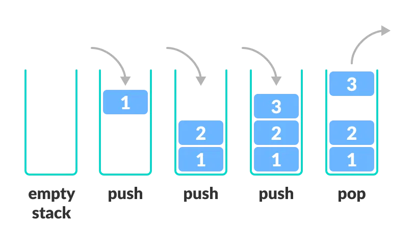

## What is Data Structure ?
--> It's a process of arranging data on a computer so that it can be accessed and updated efficiently.

### Data structures are divided into two categories- 
- Linear data structure 
- Non-linear data structure 
### Linear Data Structure - The elements are arranged in sequence one after the other.
- Array - A collection of items of the same data type stored at contiguous ( পার্শ্ববর্তী ) memory locations.
```C++
#include<iostream>
int main(){
    //Declaring an array
    int myArray[5];
    //Declaring and storint data on array
    int myArray2[3]={1,2,3};
    return 0;
}
```

```python
'''
An array is a fundamental data structure that stores elements
of the same type in a contiguous block of memory. 
'''
# Example of an array in Python
arr=[1,2,4,5,2,6]
print(arr)
# Insertion
arr.append(100) # Appends 5 to the end
arr.insert(2,66) # Inserts 66 at the index 2
# Deletion
arr.pop(1) # Delete element at index 1
arr.remove(4) # Removes the firs occurance of 4
# Searce
arr.index(2)
# Updating
arr[2]=44
#Traversal of a array
for anik in arr:
    print(anik)


'''
Advantanges : 
Fast Access: Direct access to elements using an index.
Cache Friendly: Due to contiguous memory allocation, arrays perform better in terms of caching.

Disadvantages :
Fixed Size: Static arrays have a fixed size and cannot grow dynamically.
Insertion and Deletion: These operations can be expensive as they may require shifting elements.
'''

```


## Common algorithms associated with arrays include:
- Linear search: A simple search algorithm that iterates through each element of the array to find a target value. It has a time complexity of O(n).

- Binary search: A more efficient search algorithm for sorted arrays. It repeatedly divides the search space in half, resulting in a time complexity of O(log n).

- Sorting algorithms: Various algorithms exist for sorting arrays, including bubble sort, insertion sort, selection sort, merge sort, and quick sort. These algorithms differ in their time and space complexities and are suitable for different scenarios.


-----------------
-----------------

## String - A string is a sequence of characters stored in a linear data structure.

```python
string = "hello"
print(string[1]) # Output: 'e'

# Concatenation
string1 = "hello"
string2 = "world"
result = string1 + " " + string2
print(result) # Output: 'hello world'

# Substring 
substring = string[1:4] # Output: 'ell'

# Searching
s = " hello world '
print("world" in s)
print(s.find("world"))

# Replace 
s = "hello world"
s = s.replace("world", "python")

# Split and Join
s = "hello,world,python"
print(s.split(",")) # Output: ['hello', 'world', 'python']

#Join 
s = ",".join(["hello", "world", "python"])
print(s)

# String length 
print(len(s))

# Case Conersion 
print(s.upper())
print(s.lower())

# Traversal
for char in string:
    print(char)
```

Advantage           | Disadvantage
------------------- | ------------------
Easy Manipulation: Built-in functions make string operations simple.| Immutability: Modifying a string creates a new copy, which can be inefficient for large strings.
Memory Efficient: Strings are stored contiguously in memory.| Indexing Complexity: In multi-byte encodings ( UTF-8), accessing characters by index may not be straightforward
Versatile: Widely used in text processing, web development, and data handling.|


- Linked List - Composed of nodes, where each node contains data and a reference to the next node.

- Singly Linked List: Each node points to the next node.
- Doubly Linked List: Each node points to both the next and previous nodes.
- Circular Linked List: The last node points back to the first node, forming a circle.

```python
# Linked List implementation in Python
class Node:
    def __init__(self,item):
        self.item = item
        self.next = None
class LinkedList:
    def __init__(self):
        self.head = None

if __name__ == '__main__':
    linked_list = LinkedList()

linked_list = LinkedList()
    # Assign item values
    linked_list.head = Node(1)
    second = Node(2)
    third = Node(3)

    # Connect nodes
    linked_list.head.next = second
    second.next = third
    # Print the linked list item
    while linked_list.head != None:
        print(linked_list.head.item, end=" ")
        linked_list.head = linked_list.head.next
```

- Stack : A stack is a linear data structure that follows the principle of Last In First Out (LIFO). This means the last element inserted inside the stack is removed first.

```python
# Stack implementation in python
# Creating a stack
def create_stack():
    stack = []
    return stack

# Creating an empty stack
def check_empty(stack):
    return len(stack) == 0

# Adding items into the stack
def push(stack, item):
    stack.append(item)
    print("pushed item: " + item)

# Removing an element from the stack
def pop(stack):
    if (check_empty(stack)):
        return "stack is empty"

    return stack.pop()

stack = create_stack()
push(stack, str(1))
push(stack, str(2))
push(stack, str(3))
push(stack, str(4))
print("popped item: " + pop(stack))
print("stack after popping an element: " + str(stack))
```

- Queue - Queue follows the First In First Out (FIFO) rule - the item that goes in first is the item that comes out first.

#### Basic Operation of queue - 
- Enques ( Add an  element to the end of the queue)
- Dequeue ( Remove an element form the front of the queue.)
- IsEmpty
- IsFull
- Peek( Get the value of the front of the queue without removing it.)

## Characteristics of Linear Data Structures 
1. Sequential Arrangement: Elements are stored in a linear order.
2. Single Level: All elements can be traversed in a single run.
3. Memory Efficiency


# Time and Space Complexity of Linear Data Structures

---

## **1. Array**

| Operation         | Time Complexity (Best/Average/Worst) | Space Complexity |
|--------------------|-------------------------------------|------------------|
| Access            | \(O(1)\)                           | \(O(1)\)         |
| Search            | \(O(n)\)                           | \(O(1)\)         |
| Insertion (at end)| \(O(1)\)                           | \(O(n)\)*        |
| Insertion (at pos)| \(O(n)\)                           | \(O(n)\)*        |
| Deletion (at end) | \(O(1)\)                           | \(O(n)\)*        |
| Deletion (at pos) | \(O(n)\)                           | \(O(n)\)*        |

- *Space Complexity*: When resizing occurs during dynamic array operations ( in Python lists ), additional space might temporarily be required.

---

## **2. Linked List**

| Operation         | Time Complexity (Best/Average/Worst) | Space Complexity |
|--------------------|-------------------------------------|------------------|
| Access            | \(O(n)\)                           | \(O(1)\)         |
| Search            | \(O(n)\)                           | \(O(1)\)         |
| Insertion (at end)| \(O(1)\)                           | \(O(1)\)         |
| Insertion (at pos)| \(O(n)\)                           | \(O(1)\)         |
| Deletion (at end) | \(O(1)\)                           | \(O(1)\)         |
| Deletion (at pos) | \(O(n)\)                           | \(O(1)\)         |

---

## **3. Stack**

| Operation         | Time Complexity (Best/Average/Worst) | Space Complexity |
|--------------------|-------------------------------------|------------------|
| Push              | \(O(1)\)                           | \(O(n)\)         |
| Pop               | \(O(1)\)                           | \(O(n)\)         |
| Peek              | \(O(1)\)                           | \(O(n)\)         |
| Search            | \(O(n)\)                           | \(O(n)\)         |

---

## **4. Queue**

| Operation         | Time Complexity (Best/Average/Worst) | Space Complexity |
|--------------------|-------------------------------------|------------------|
| Enqueue           | \(O(1)\)                           | \(O(n)\)         |
| Dequeue           | \(O(1)\)                           | \(O(n)\)         |
| Peek/Front        | \(O(1)\)                           | \(O(n)\)         |
| Search            | \(O(n)\)                           | \(O(n)\)         |

---

## **5. Deque (Double-Ended Queue)**

| Operation         | Time Complexity (Best/Average/Worst) | Space Complexity |
|--------------------|-------------------------------------|------------------|
| Enqueue (front)   | \(O(1)\)                           | \(O(n)\)         |
| Enqueue (rear)    | \(O(1)\)                           | \(O(n)\)         |
| Dequeue (front)   | \(O(1)\)                           | \(O(n)\)         |
| Dequeue (rear)    | \(O(1)\)                           | \(O(n)\)         |
| Search            | \(O(n)\)                           | \(O(n)\)         |

---

## **Explanation of Terms**

1. **Access**: Reading the value at a specific index.
2. **Search**: Finding an element in the data structure.
3. **Insertion**: Adding an element to the data structure.
4. **Deletion**: Removing an element from the data structure.

### Some Extra Informations :
- **Array**: Best for fast access but expensive for insertion/deletion in the middle.
- **Linked List**: Flexible but slower access and higher memory usage due to pointers.
- **Stack & Queue**: Specialized for Last-In-First-Out (LIFO) or First-In-First-Out (FIFO) operations, respectively.
- **Deque**: Allows operations at both ends with constant time complexity.


## Non-linear data structures 
- Graph DS : A graph data structure is a collection of nodes that have data and connected to other nodes.
**Anything that has data is a node.Graph ds consist Nodes/Vertices and Edges.**

### Components of Graph DS - 
- Vertics : Those are fundamental units of the graph.
- Edge : Edges are drawn or used to connect two nodes of the graph.

## Graph Terminologys 
- **Adjacency**: The relationship between two nodes that are connected by an edge. Vertices 2 and 3 are not adjacent because there is no edge between them.

- **Path**:Path: A sequence of edges that allows you to go from vertex A to vertex B is called a path. 0-1, 1-2 and 0-2 are paths from vertex 0 to vertex 2.
- **Directed Graph** : A graph in which an edge (u,v) doesn't necessarily mean that there is an edge (v, u) as well. The edges in such a graph are represented by arrows to show the direction of the edge.
- **Undirected Graph** : A graph in which an edge (u,v) means that ther

## Adjacency Matrix- 
- **Adjacency Matrix**: The adjacency matrix is a 2D array representation of a graph, where each cell at position (i, j) indicates whether there is an edge between vertex i and vertex j.
Structure
Vertices (Nodes): Represented by the rows and columns of the matrix.
Edges (Connections): Represented by the values in the matrix.


## **Adjacency List** :The adjacency list is a space-efficient way to represent a graph. In this representation, each vertex is associated with a list of all its adjacent (or connected) vertices.
Structure
Vertices (Nodes): Each vertex is represented as a key in a dictionary (or an array index).
Edges (Connections): The value for each key is a list (or set) containing the vertices it is connected to.


## **Tree Data Structure** :
- **Tree**: A tree is a data structure that consists of nodes, where each node has a value and zero or more child nodes. The topmost node is called the root node.However, in tree data structure, there can only be one edge between two vertices.


**Root**:The topmost node of a tree.
**Height of a Node**:The depth of a node is the number of edges from the root to the node.
**Depth of a Node**:The depth of a node is the number of edges from the root to the node.
**Height of a Tree**:The height of a Tree is the height of the root node or the depth of the deepest node.

**Degree of a Node**:The degree of a node is the total number of branches of that node.
**Forest**: A collection of disjoint trees is called a forest.


**Types of Tree**
1. Binary Tree -It is a tree data structure in which each parent node can have at most two children. Each node of a binary tree consists of three items:
- data item
- address of left child
- address of right child

2. Binary Search Tree- is a data structure used in computer science for organizing and storing data in a sorted manner. Binary search tree follows all properties of binary tree and for every nodes, its left subtree contains values less than the node and the right subtree contains values greater than the node. 


# **Complexity of Non-Linear Data Structures**

---

## **1. Trees**

### **Binary Tree**
| Operation       | Average Case | Worst Case |
|-----------------|--------------|------------|
| **Search**      | \(O(n)\)     | \(O(n)\)   |
| **Insert**      | \(O(n)\)     | \(O(n)\)   |
| **Delete**      | \(O(n)\)     | \(O(n)\)   |
| **Space**       | \(O(n)\)     | \(O(n)\)   |

**Explanation**: Traversing all nodes takes \(O(n)\) time. For skewed binary trees, the depth increases to \(O(n)\).

---

### **Binary Search Tree (BST)**
| Operation       | Average Case | Worst Case |
|-----------------|--------------|------------|
| **Search**      | \(O(\log n)\)| \(O(n)\)   |
| **Insert**      | \(O(\log n)\)| \(O(n)\)   |
| **Delete**      | \(O(\log n)\)| \(O(n)\)   |
| **Space**       | \(O(n)\)     | \(O(n)\)   |

**Worst Case**: Occurs when the BST becomes skewed.

---

### **Balanced Binary Search Tree** (e.g., AVL, Red-Black Tree)
| Operation       | Average Case | Worst Case |
|-----------------|--------------|------------|
| **Search**      | \(O(\log n)\)| \(O(\log n)\) |
| **Insert**      | \(O(\log n)\)| \(O(\log n)\) |
| **Delete**      | \(O(\log n)\)| \(O(\log n)\) |
| **Space**       | \(O(n)\)     | \(O(n)\)   |

**Explanation**: Balanced trees maintain \(O(\log n)\) height, ensuring efficient operations.

---

### **Heap**
| Operation       | Average Case | Worst Case |
|-----------------|--------------|------------|
| **Insert**      | \(O(\log n)\)| \(O(\log n)\) |
| **Delete Min/Max** | \(O(\log n)\)| \(O(\log n)\) |
| **Search**      | \(O(n)\)     | \(O(n)\)   |
| **Space**       | \(O(n)\)     | \(O(n)\)   |

**Explanation**: Insertions and deletions adjust the heap property in \(O(\log n)\) time.

---

## **2. Graphs**

### **Adjacency Matrix**
| Operation         | Complexity   |
|-------------------|--------------|
| **Storage**       | \(O(V^2)\)   |
| **Add Vertex**    | \(O(V^2)\)   |
| **Add Edge**      | \(O(1)\)     |
| **Remove Edge**   | \(O(1)\)     |
| **Check Edge**    | \(O(1)\)     |
| **Space**         | \(O(V^2)\)   |

**V**: Number of vertices.

---

### **Adjacency List**
| Operation         | Complexity       |
|-------------------|------------------|
| **Storage**       | \(O(V + E)\)     |
| **Add Vertex**    | \(O(1)\)         |
| **Add Edge**      | \(O(1)\)         |
| **Remove Edge**   | \(O(E)\)         |
| **Check Edge**    | \(O(V)\)         |
| **Space**         | \(O(V + E)\)     |

**E**: Number of edges.

---

### **Graph Traversal Algorithms**

| Algorithm         | Time Complexity | Space Complexity |
|-------------------|-----------------|------------------|
| **BFS (Adj. List)** | \(O(V + E)\)    | \(O(V)\)          |
| **DFS (Adj. List)** | \(O(V + E)\)    | \(O(V)\)          |
| **Dijkstra**        | \(O(E + V\log V)\) | \(O(V^2)\) or \(O(E + V\log V)\) with priority queue |
| **Kruskal's**       | \(O(E\log E)\)  | \(O(E + V)\)      |
| **Prim's**          | \(O(E + V\log V)\)| \(O(V^2)\) or optimized for \(O(E + V\log V)\) |

---

## **3. Trie (Prefix Tree)**

| Operation         | Time Complexity | Space Complexity |
|-------------------|-----------------|------------------|
| **Insert**        | \(O(L)\)        | \(O(N \cdot L)\) |
| **Search**        | \(O(L)\)        | \(O(1)\)         |
| **Delete**        | \(O(L)\)        | \(O(1)\)         |

**L**: Length of the word.  
**N**: Number of keys in the Trie.

---

## **Summary Table of Non-Linear Data Structures**

| Data Structure        | Time Complexity for Operations       | Space Complexity  |
|------------------------|---------------------------------------|-------------------|
| **Binary Tree**        | \(O(n)\)                             | \(O(n)\)          |
| **Binary Search Tree** | \(O(\log n)\) / \(O(n)\) (worst)     | \(O(n)\)          |
| **Balanced BST**       | \(O(\log n)\)                        | \(O(n)\)          |
| **Heap**               | \(O(\log n)\) for insert/delete      | \(O(n)\)          |
| **Adjacency Matrix**   | \(O(1)\) for edge operations         | \(O(V^2)\)        |
| **Adjacency List**     | \(O(V + E)\) for traversal           | \(O(V + E)\)      |
| **Trie**               | \(O(L)\) for insert/search/delete    | \(O(N \cdot L)\)  |

---

## **Key Notes**
1. **Trees** and **graphs** differ in their structure, traversal algorithms, and complexities.
2. **Trie** is efficient for prefix-based search but can consume large amounts of memory.
3. **Graph** complexities depend on whether the graph is stored using adjacency matrices or lists.
4. **Balanced trees** (e.g., AVL, Red-Black) guarantee efficient operations with \(O(\log n)\) time complexities.

-------


## Object Oriented Programming 
### What is Object-Oriented Programming?
Object-Oriented Programming is a programming paradigm based on the concept of objects. Objects represent real-world entities and have:

- Attributes (Properties): Define the state of the object (data).
- Methods (Behaviors): Define the actions the object can perform (functions).

## Core stuff of OOP
 Class and Object
- Class: A blueprint for creating objects. It defines attributes and methods.
- Object: An instance of a class.
```python 
# Class definition
class Car:
    def __init__(self, brand, color):
        self.brand = brand  # Attribute
        self.color = color  # Attribute

    def drive(self):  # Method
        print(f"The {self.color} {self.brand} is driving.")

# Creating objects
car1 = Car("Toyota", "red")
car2 = Car("Honda", "blue")
car1.drive()  # Output: The red Toyota is driving.
car2.drive()  # Output: The blue Honda is driving.
```

 ### Encapsulation- Encapsulation is the bundling of data (attributes) and methods into a single unit (class) and restricting access to some components using access modifiers:

- Private: Only accessible within the class. (use double undersoce: __ )
- Protected: Accessible within the class and subclasses.( use single underscore: _ )
- Public: Accessible from anywhere.
```python 
class BankAccount:
    def __init__(self, owner, balance):
        self.owner = owner      # Public attribute
        self.__balance = balance  # Private attribute

    def deposit(self, amount):
        self.__balance += amount

    def get_balance(self):
        return self.__balance

# Usage
account = BankAccount("John", 1000)
account.deposit(500)
print(account.get_balance())  # Output: 1500
# print(account.__balance)    # Error: Private attribute

```

### Inheritance- Inheritance allows a class (child) to inherit attributes and methods from another class (parent), promoting code reuse.

```python 
# Parent class
class Animal:
    def __init__(self, name):
        self.name = name

    def speak(self):
        print(f"{self.name} makes a sound.")

# Child class
class Dog(Animal):
    def speak(self):
        print(f"{self.name} barks.")

# Usage
dog = Dog("Rex")
dog.speak()  # Output: Rex barks

```
### Polymorphism- Polymorphism means "many forms" and allows methods to behave differently based on the object calling them.
```python
class Shape:
    def area(self):
        pass

class Circle(Shape):
    def area(self, radius):
        return 3.14 * radius * radius

class Rectangle(Shape):
    def area(self, width, height):
        return width * height

# Usage
circle = Circle()
rectangle = Rectangle()
print(circle.area(5))  # Output: 78.5
print(rectangle.area(4, 5))  # Output: 20

```

### Abstraction- Abstraction hides the internal implementation details and shows only the essential features. Abstract classes define a common interface for subclasses.
```python 
from abc import ABC, abstractmethod

class Vehicle(ABC):
    @abstractmethod
    def start_engine(self):
        pass

class Car(Vehicle):
    def start_engine(self):
        print("Car engine started.")

# Usage
car = Car()
car.start_engine()  # Output: Car engine started

```

## Advance OOP Concept
### Method Overloading (Compile-Time Polymorphism)
Allows multiple methods with the same name but different parameters.
```python 
class Calculator:
    def add(self, a, b, c=0):
        return a + b + c

calc = Calculator()
print(calc.add(1, 2))       # Output: 3
print(calc.add(1, 2, 3))    # Output: 6
```
### Method Overriding (Run-Time Polymorphism)
Allows a subclass to provide a specific implementation of a method already defined in the parent class.
```python 
class Parent:
    def show(self):
        print("Parent class")

class Child(Parent):
    def show(self):
        print("Child class")

child = Child()
child.show()  # Output: Child class
```

### Multiple Inheritance
A class can inherit from multiple parent classes.
```python
class A:
    def method_a(self):
        print("Method A")

class B:
    def method_b(self):
        print("Method B")

class C(A, B):
    pass

obj = C()
obj.method_a()  # Output: Method A
obj.method_b()  # Output: Method B
```
###  Composition
A "has-a" relationship where a class contains an object of another class.
```python 
class Engine:
    def start(self):
        print("Engine started.")

class Car:
    def __init__(self):
        self.engine = Engine()

    def start(self):
        self.engine.start()
        print("Car is ready to go.")

car = Car()
car.start()
```
## Static Methods and Class Methods
### Static Methods: Methods that don’t depend on instance variables.
### Class Methods: Methods that work with class-level data.
```python
class Math:
    @staticmethod
    def add(a, b):
        return a + b

    @classmethod
    def description(cls):
        return "This is a Math class."

print(Math.add(3, 4))  # Output: 7
print(Math.description())  # Output: This is a Math class.
```

## Benefits of OOP
- Modularity: Code is organized into classes and objects.
- Reusability: Classes and methods can be reused across projects.
- Scalability: Easy to maintain and scale code.
- Abstraction and Encapsulation: Enhance security by restricting access to internal data.


## Dynamic Programming 
-> Dynamic Programming (DP) is a method for solving complex problems by breaking them down into simpler subproblems, solving each subproblem only once, and storing the results for future reference. It is particularly useful for optimization problems and problems that exhibit overlapping subproblems and optimal substructure properties.

## Overlapping Subproblems- The problem can be divided into smaller subproblems, and these subproblems are reused multiple times. Dynamic programming takes advantage of this by storing the results of subproblems in a table (usually an array or a dictionary) to avoid redundant calculations.

## Optimal Substructure-The solution to the overall problem can be derived from the solutions of its subproblems.This means that the solution to the overall problem can be derived from the solutions to smaller instances of the same problem.Example: In the shortest path problem, the shortest path from A to C through B can be broken into:
- Shortest path from A to B.
- Shortest path from B to C.

## Memoization (Top-Down Approach): This technique involves solving the problem recursively and storing the results of subproblems in a cache (usually a dictionary or an array). If the same subproblem is encountered again, the cached result is used instead of recalculating it.

## Tabulation (Bottom-Up Approach): This technique involves solving the problem iteratively and filling up a table (usually an array) in a bottom-up manner. The table is filled based on previously computed values.